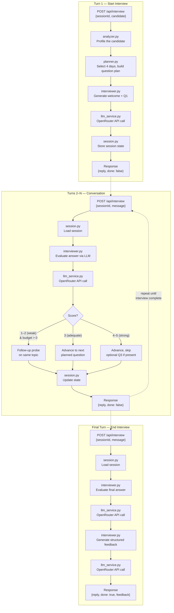
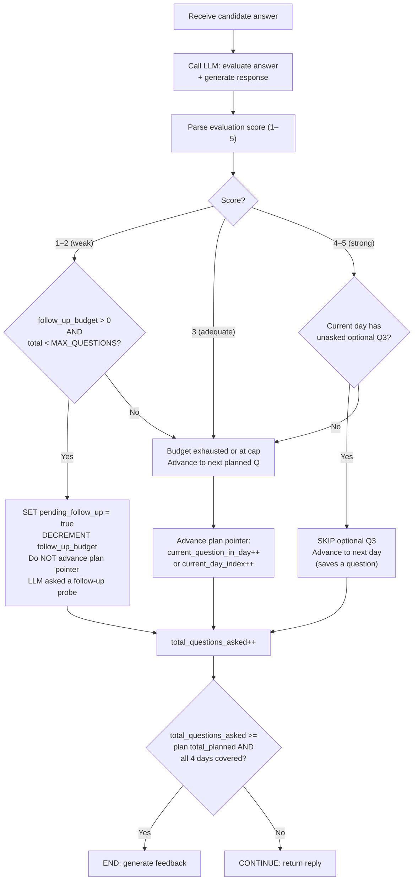

# AI Interview Agent — Architecture & Implementation Plan

## Goal

Build a personalized AI technical interviewer for the ABTalks hackathon. The agent exposes a single `POST /api/interview` endpoint, uses the candidate's progress and the 31-day curriculum to conduct an adaptive multi-turn interview (≥8 questions across 4 curriculum days), and returns structured actionable feedback at the end.

---

## Tech Stack

| Layer | Choice | Why |
|---|---|---|
| Language | **Python 3.11+** | Fast to develop, excellent LLM ecosystem |
| HTTP Server | **FastAPI + Uvicorn** | Single endpoint, auto-docs, Pydantic validation |
| LLM Gateway | **OpenRouter** (OpenAI-compatible API) | Free model access, single API for multiple providers |
| LLM Models | **Free models via OpenRouter**, fallback to **Gemini 2.5 Flash** | Zero cost, reliable fallback |
| Frontend | **React + Vite** | Fast dev server, modern tooling, simple chat UI |
| Session Store | **In-memory `dict`** | Hackathon-simple, no external DB needed |
| Validation | **Pydantic v2** | Already bundled with FastAPI |
| Deployment | **Local-first** (uvicorn + vite dev), **Docker Compose ready** | Develop fast, package for demo when needed |

> [!NOTE]
> No database, no Redis, no LangChain, no vector store. The LLM is accessed through OpenRouter's OpenAI-compatible API, so we use the standard `openai` Python SDK pointed at `https://openrouter.ai/api/v1`. This gives us free model access and the ability to swap models with a single config change.

---

## Project Structure

```
/home/hs/Projects/Interview-Agent/
├── app/
│   ├── main.py              # FastAPI app, single POST /api/interview route, CORS
│   ├── models.py            # Pydantic schemas (request, response, session)
│   ├── session.py           # In-memory session store (dict keyed by sessionId)
│   ├── analyzer.py          # Candidate profile analysis (pure Python)
│   ├── planner.py           # Interview plan: day selection + question distribution
│   ├── interviewer.py       # Core turn logic — orchestrates LLM calls
│   ├── llm_service.py       # LLM abstraction layer (provider-agnostic)
│   ├── prompts.py           # All LLM system/user prompt templates
│   └── config.py            # API key, model name, interview settings
├── frontend/                # React + Vite chat UI
│   ├── index.html
│   ├── package.json
│   ├── vite.config.js
│   └── src/
│       ├── main.jsx
│       ├── App.jsx           # Root component with routing/state
│       ├── App.css           # Global styles
│       └── components/
│           ├── ChatWindow.jsx    # Message list + input
│           ├── CandidateSelect.jsx  # Candidate picker to start interview
│           └── FeedbackPanel.jsx    # Structured feedback display
├── data/
│   ├── candidates.json      # (existing) Candidate data
│   └── curriculum.json      # (existing) 31-day curriculum data
├── docker-compose.yml       # Backend + frontend containers
├── Dockerfile.backend
├── Dockerfile.frontend
├── requirements.txt
└── README.md
```

---

## Data Flow — End to End



---

## Component Design

### 1. `llm_service.py` — LLM Abstraction Layer

This is the **only module that knows about OpenRouter, API keys, or model names**. Every other module calls this service and is completely provider-agnostic.

#### Interface

```python
class LLMService:
    """Provider-agnostic LLM interface. Swap models/providers here only."""

    async def chat(
        self,
        system_prompt: str,
        messages: list[dict],       # [{"role": "user"/"assistant", "content": "..."}]
        temperature: float = 0.7,
    ) -> str:
        """Send a conversation to the LLM, return the raw text response."""

    async def chat_json(
        self,
        system_prompt: str,
        messages: list[dict],
        temperature: float = 0.7,
    ) -> dict:
        """Send a conversation to the LLM, parse and return JSON response."""
```

#### Implementation

```python
from openai import AsyncOpenAI

class OpenRouterLLMService(LLMService):
    def __init__(self):
        self.client = AsyncOpenAI(
            base_url="https://openrouter.ai/api/v1",
            api_key=config.OPENROUTER_API_KEY,
        )
        self.model = config.LLM_MODEL  # e.g. "google/gemini-2.5-flash"

    async def chat(self, system_prompt, messages, temperature=0.7):
        response = await self.client.chat.completions.create(
            model=self.model,
            messages=[{"role": "system", "content": system_prompt}] + messages,
            temperature=temperature,
        )
        return response.choices[0].message.content

    async def chat_json(self, system_prompt, messages, temperature=0.7):
        raw = await self.chat(system_prompt, messages, temperature)
        return parse_json_from_response(raw)  # Strip markdown fences, parse
```

> [!TIP]
> To switch models, change one line in `config.py`. To switch providers entirely (e.g., direct Gemini SDK, local Ollama), create a new class implementing the same `chat()` / `chat_json()` interface. Zero changes to `interviewer.py` or any other module.

---

### 2. `analyzer.py` — Candidate Profiling (Pure Python, no LLM)

Analyzes the raw candidate object and produces a structured profile used by the planner and prompts.

**Input**: Raw candidate object from the request body.

**Output**: `CandidateProfile` dataclass with:

| Field | Description |
|---|---|
| `name`, `role`, `experience` | Identity basics |
| `strong_days` | Missions passed on first attempt (attempts = 1) |
| `struggled_days` | Missions passed but with ≥3 attempts |
| `failed_days` | Missions where `passed = false` |
| `skipped_days` | Missions where `skipped = true` |
| `not_attempted_days` | Curriculum days with no mission entry at all |
| `completion_rate` | `missionsCompleted / 31` |
| `first_try_rate` | `missionsFirstTry / missionsCompleted` |
| `calibration_level` | `"junior"` / `"mid"` / `"senior"` — derived from role + experience + signals |

**Key logic**: Each mission is mapped to its curriculum day object (matching by `day` number) to attach the full topic context (title, type, tools, objectives).

---

### 3. `planner.py` — Interview Plan (Pure Python, no LLM)

Selects exactly **4 curriculum days** and distributes **≥8 questions** across them.

#### Day Selection Algorithm

Each of the 31 curriculum days is scored. The top 4 are selected, with a constraint that they span at least 3 different modules.

| Candidate's relationship to the day | Priority Score |
|---|---|
| **Failed** the mission (`passed: false`) | 100 |
| **Skipped** the mission | 80 |
| **Struggled** (passed, ≥3 attempts) | 70 |
| **Passed with effort** (2 attempts) | 40 |
| **Passed first try** — but is a core AI topic (days 7–15, 21–24) | 30 |
| **Passed first try** — non-core topic | 10 |
| **Not attempted** — topic relevant to their job role | 50 |
| **Not attempted** — topic not relevant | 5 |

> [!IMPORTANT]
> The scoring is deliberately weighted so the interview probes **weaknesses and gaps** more than strengths. This makes the interview genuinely diagnostic — a candidate who aced everything still gets depth-tested on core AI topics, while a candidate who struggled gets targeted questions where they need growth.

#### Question Distribution

After selecting 4 days, questions are distributed based on the day's priority:

- **2 questions** for each of the 4 days = 8 minimum planned
- If a day has the highest priority (failed/skipped), allocate **3 questions** to it
- Maximum **10 planned questions** across the 4 days

#### Question Types per Day

| Slot | Type | Purpose |
|---|---|---|
| Q1 | **Conceptual** | "Explain X", "What is the purpose of Y" — tests understanding |
| Q2 | **Applied / Scenario** | "How would you use X to solve Y" — tests practical ability |
| Q3 (if allocated) | **Diagnostic probe** | Targets the specific gap (e.g., "You skipped Day 14 on fine-tuning — when would you choose fine-tuning over RAG?") |

---

### 4. `session.py` — Session State

An in-memory dictionary `sessions: dict[str, InterviewSession]`.

```python
@dataclass
class InterviewSession:
    session_id: str
    candidate: dict                    # Raw candidate object
    profile: CandidateProfile          # Analyzed profile
    plan: InterviewPlan                # Selected days + question slots

    # --- Conversation ---
    conversation: list[dict]           # [{"role": "interviewer"/"candidate", "content": "..."}]

    # --- Evaluation tracking ---
    evaluations: list[QuestionEval]    # Per-question: {day, question_type, score, notes}

    # --- Question counter state ---
    current_day_index: int             # Which of the 4 selected days (0–3)
    current_question_in_day: int       # Which question within current day (0–2)
    total_questions_asked: int         # Running count of all questions (planned + follow-ups)

    # --- Adaptive follow-up state ---
    follow_up_budget: int              # Starts at FOLLOW_UP_BUDGET (e.g., 4), decrements on use
    pending_follow_up: bool            # True = next turn is a follow-up, not advancing the plan
    last_eval_score: int | None        # Score from the most recent evaluation (drives decisions)

    # --- Status ---
    status: str                        # "in_progress" | "completed"
```

---

### 5. `interviewer.py` — Core Turn Logic (Orchestrator + LLM)

This is the brain. It uses Python control flow for state management and calls `llm_service` for natural language generation. **It never imports `openai` or knows about OpenRouter.**

#### Adaptive Follow-Up Logic — Detailed



#### Hard Constraints Enforced by the Orchestrator

| Constraint | How it's enforced |
|---|---|
| **≥8 questions** | The plan starts with 8–10 planned questions. Follow-ups are *additional*. Planned questions are never skipped (only optional Q3 on strong answers). The minimum 2 per day is always met. |
| **4 curriculum days** | Each day has a guaranteed minimum of 2 planned questions (Q1 + Q2). Q3 is the only skippable slot. Even if Q3 is skipped, the day still had 2 questions — it's covered. |
| **Follow-ups don't break the plan** | A follow-up *pauses* the plan pointer (doesn't advance it). The planned Q still gets asked on the *next* turn. Follow-ups are bounded by `follow_up_budget` AND `MAX_QUESTIONS`. |
| **Interview stays bounded** | `MAX_QUESTIONS = 12` is a hard ceiling. No more LLM calls after this, regardless of budget remaining. |

#### Question Budget Arithmetic

```
PLANNED QUESTIONS:  8–10  (set by planner, guaranteed to execute)
FOLLOW-UP BUDGET:   4     (extra slots for adaptive probes)
MAX_QUESTIONS:      12    (hard ceiling — planned + follow-ups combined)

Worst case:  10 planned + 2 follow-ups = 12 (hits cap)
Best case:   8 planned + 0 follow-ups = 8  (strong candidate, everything skipped/advanced)
Typical:     8 planned + 2 follow-ups = 10
```

#### Turn Logic Pseudocode

```python
async def handle_turn(session, candidate_message):

    if candidate_message is None:
        # === START: Init request — generate welcome + first question ===
        reply = await generate_welcome_and_first_question(session)
        session.conversation.append({"role": "interviewer", "content": reply})
        session.total_questions_asked = 1
        return {"reply": reply, "done": False}

    # 1. Record the candidate's answer
    session.conversation.append({"role": "candidate", "content": candidate_message})

    # 2. Determine what kind of turn this is
    if session.pending_follow_up:
        turn_type = "follow_up"
    else:
        turn_type = get_planned_question_type(session)  # "conceptual" / "applied" / "diagnostic"

    # 3. Call LLM: evaluate answer + generate next question (or follow-up)
    llm_response = await llm.chat_json(
        system_prompt = build_system_prompt(session),
        messages      = build_messages(session, turn_type),
    )

    evaluation = llm_response["evaluation"]   # {"score": 1-5, "notes": "..."}
    next_reply = llm_response["reply"]

    # 4. Store evaluation
    session.evaluations.append({
        "day": current_day(session),
        "question_type": turn_type,
        "score": evaluation["score"],
        "notes": evaluation["notes"],
    })

    # 5. Clear any pending follow-up flag (we just completed it)
    session.pending_follow_up = False

    # 6. === ADAPTIVE DECISION: what happens next? ===
    score = evaluation["score"]

    if score <= 2 and can_follow_up(session):
        # WEAK answer — stay on the same topic, insert a probe
        session.pending_follow_up = True
        session.follow_up_budget -= 1
        # Do NOT advance plan pointer — the next planned Q is still pending
    elif score >= 4 and has_optional_q3(session):
        # STRONG answer — skip the optional Q3, jump to next day
        skip_optional_q3(session)
        advance_plan(session)
    else:
        # ADEQUATE or no budget — advance normally
        advance_plan(session)

    session.total_questions_asked += 1

    # 7. Check if interview should end
    if is_interview_complete(session):
        feedback = await generate_feedback(session)
        session.status = "completed"
        return {"reply": next_reply, "done": True, "feedback": feedback}

    # 8. Continue
    session.conversation.append({"role": "interviewer", "content": next_reply})
    return {"reply": next_reply, "done": False}


def can_follow_up(session) -> bool:
    """Follow-up is allowed only if budget remains AND hard cap not reached."""
    return (
        session.follow_up_budget > 0
        and session.total_questions_asked + 1 < config.MAX_QUESTIONS
        and remaining_planned_questions(session) > 0  # Don't probe if we'd never finish
    )


def is_interview_complete(session) -> bool:
    """Interview ends when all planned questions are done (follow-ups don't extend)."""
    return (
        session.current_day_index >= len(session.plan.days)  # All 4 days exhausted
        or session.total_questions_asked >= config.MAX_QUESTIONS  # Hard cap
    )
```

#### LLM Call Strategy

| When | LLM Calls | Purpose |
|---|---|---|
| **Start** (Turn 1) | 1 call | Generate welcome message + first question |
| **Each subsequent turn** | 1 call | Evaluate previous answer + generate next question **or** follow-up probe |
| **Final turn** | 2 calls | Evaluate final answer + generate structured feedback |

**Total LLM calls for a full interview**: ~10–14 (one per turn + one for feedback). Varies based on how many follow-ups are triggered.

---

### 6. `prompts.py` — LLM Prompt Design

#### System Prompt (Sent with Every Call)

```
You are a senior technical interviewer conducting a personalized interview
for the ABTalks AI program. You are warm but rigorous, conversational but
structured.

CANDIDATE PROFILE:
- Name: {name}
- Role: {role} ({experience} years experience)
- Education: {education}
- Calibration: {calibration_level}
- Completion Rate: {completion_rate}%
- Strengths: {strong_topics}
- Gaps: {weak_topics}

INTERVIEW PLAN:
You will cover these 4 curriculum topics in order:
1. Day {d1}: {title1} — {num_questions1} questions
2. Day {d2}: {title2} — {num_questions2} questions
3. Day {d3}: {title3} — {num_questions3} questions
4. Day {d4}: {title4} — {num_questions4} questions

CURRICULUM CONTEXT FOR CURRENT DAY:
Day {current_day}: {title}
Objectives: {objectives}
Tools: {tools}

RULES:
- Calibrate difficulty to the candidate's level ({calibration_level})
- Ask questions that test understanding, not memorization
- If the candidate gives a weak answer, gently probe deeper before moving on
- If the candidate gives a strong answer, acknowledge it and move forward
- Keep responses concise (2-4 sentences + 1 question)
- Never reveal your evaluation or scoring to the candidate
```

#### Per-Turn Instruction — Advance to Next Planned Question

Used when the orchestrator decides to move forward (score 3+, or score 1–2 with no budget).

```
The candidate just answered your previous question. Do the following:

1. Internally evaluate their answer (score 1-5, brief notes)
2. Respond naturally — acknowledge their answer briefly
3. Ask the NEXT question: a {question_type} question about "{topic}"
   Curriculum context for this topic: {day_objectives}

Respond in this exact JSON format:
{
  "evaluation": {"score": <1-5>, "notes": "<brief assessment>"},
  "reply": "<your conversational response + next question>"
}
```

#### Per-Turn Instruction — Follow-Up Probe (Weak Answer)

Used when the orchestrator detects a weak answer (score 1–2) and has follow-up budget remaining.

```
The candidate just answered your previous question. Their answer was weak or
incomplete. Do the following:

1. Internally evaluate their answer (score 1-5, brief notes)
2. Respond naturally — acknowledge what they got right, if anything
3. Ask a FOLLOW-UP PROBE on the SAME topic to help them demonstrate deeper
   understanding. Do NOT move to a new topic. Rephrase, simplify, or ask
   about a specific aspect they missed.

   Current topic: "{topic}"
   What they may have missed: {day_objectives}

Respond in this exact JSON format:
{
  "evaluation": {"score": <1-5>, "notes": "<brief assessment>"},
  "reply": "<your conversational acknowledgment + follow-up probe question>"
}
```

#### Feedback Prompt (Final Call)

```
Based on the full interview, generate structured feedback.

CANDIDATE: {name} — {role} ({experience} years)

INTERVIEW TRANSCRIPT:
{full_conversation}

PER-QUESTION EVALUATIONS:
{evaluations_list}

Respond in this exact JSON format:
{
  "summary": "<2-3 sentence overall assessment>",
  "strengths": ["<strength 1>", "<strength 2>", ...],
  "gaps": ["<gap 1>", "<gap 2>", ...],
  "next": ["<recommendation 1>", "<recommendation 2>", ...]
}

Each array should have 3-5 concise, actionable points.
```

---

### 7. `main.py` — The POST /api/interview Route

Single route, branching on request content. CORS enabled for the React frontend.

```python
@app.post("/api/interview")
async def interview(request: InterviewRequest):

    if request.candidate:
        # === START: New interview session ===
        profile = analyze_candidate(request.candidate, curriculum)
        plan = build_interview_plan(profile, curriculum)
        session = create_session(request.session_id, request.candidate, profile, plan)
        reply = await generate_first_question(session)
        return {"reply": reply, "done": False}

    elif request.message:
        # === TURN: Continue existing interview ===
        session = get_session(request.session_id)
        result = await handle_turn(session, request.message)
        return result

    else:
        raise HTTPException(400, "Request must contain 'candidate' or 'message'")
```

---

### 8. `config.py` — Configuration

```python
import os

# --- LLM ---
OPENROUTER_API_KEY = os.getenv("OPENROUTER_API_KEY")
LLM_MODEL = os.getenv("LLM_MODEL", "google/gemini-2.5-flash")  # Any OpenRouter model ID

# --- Interview ---
MIN_QUESTIONS = 8
MAX_QUESTIONS = 12
NUM_INTERVIEW_DAYS = 4
MIN_MODULES_COVERED = 3
FOLLOW_UP_BUDGET = 4     # Max additional probes allowed per interview
```

---

## Adaptive Questioning — Summary

The adaptiveness comes from three layers working together:

### Layer 1: Plan-level personalization (before the interview starts)
The day-selection algorithm personalizes *which topics* to cover based on the candidate's specific gaps and strengths. Two different candidates will get entirely different interviews.

### Layer 2: Evaluation-driven flow control (during the interview)
The Python orchestrator uses each answer's evaluation score to decide what happens next:

| Score | Meaning | Orchestrator action |
|---|---|---|
| **1–2** | Weak / incomplete | Insert a follow-up probe on the same topic (if budget allows) |
| **3** | Adequate | Advance to the next planned question |
| **4–5** | Strong / comprehensive | Advance; skip optional Q3 if present on this day |

### Layer 3: LLM-level natural adaptation (within each turn)
The LLM receives the full conversation history and candidate profile, so it naturally:
- Calibrates language complexity to the candidate's level
- Varies question phrasing based on what's already been discussed
- Makes follow-up probes specific to the weak parts of the candidate's answer

### Guarantees

| Invariant | Mechanism |
|---|---|
| ≥8 questions are always asked | Planned questions (8–10) are never skipped; follow-ups are *additional* |
| All 4 days are always covered | Each day has ≥2 guaranteed planned questions (Q1 + Q2); only Q3 is skippable |
| Interview doesn't run forever | `MAX_QUESTIONS = 12` hard cap; `FOLLOW_UP_BUDGET = 4` soft cap |
| Follow-ups don't starve later days | `can_follow_up()` checks that remaining planned questions still fit under the cap |

---

## Curriculum Data Usage

The curriculum JSON is loaded once at startup and used as a **lookup table**:
- `planner.py` uses `modules[]` for diversity constraints and `days[]` for scoring
- `prompts.py` injects `days[].objectives` and `days[].tools` into LLM context so the LLM knows *what* to ask about
- `analyzer.py` maps candidate missions to curriculum days by the `day` field

The candidate JSON is **not** loaded at startup — each candidate is provided in the request body per the spec.

---

## Frontend — React + Vite Chat UI

A minimal but polished chat interface with three components:

1. **CandidateSelect** — Load `candidates.json`, show a dropdown/card picker to select a candidate
2. **ChatWindow** — Send/receive messages via `POST /api/interview`, display conversation in real-time
3. **FeedbackPanel** — When `done: true`, render the structured feedback (summary, strengths, gaps, next steps)

Communication with the backend uses `fetch()` against `http://localhost:8000/api/interview`. The frontend generates a `sessionId` (UUID) when starting a new interview.

---

## Deployment

**Local-first development:**
- Backend: `uvicorn app.main:app --reload --port 8000`
- Frontend: `cd frontend && npm run dev` (Vite dev server with proxy to backend)

**Docker Compose** (for packaging / demo):
- `Dockerfile.backend` — Python image, installs requirements, runs uvicorn
- `Dockerfile.frontend` — Node image, builds Vite, serves with nginx
- `docker-compose.yml` — Orchestrates both containers + passes env vars

Docker files will be created *after* the core logic is working locally.

---

## Verification Plan

### Automated Tests
```bash
# Start the backend
uvicorn app.main:app --port 8000

# Start the frontend
cd frontend && npm run dev

# Test 1: Start interview — send candidate, expect welcome + first question
curl -X POST http://localhost:8000/api/interview \
  -H "Content-Type: application/json" \
  -d '{"sessionId": "test-1", "candidate": { <candidate object> }}'

# Test 2: Send answers for all turns, verify done:false until final turn
# Test 3: Verify final response has done:true + feedback with all 4 fields
# Test 4: Test with different candidate profiles to verify personalization
# Test 5: Send deliberately weak answers, verify follow-up probes are triggered
# Test 6: Send strong answers, verify optional Q3s are skipped
# Test 7: Verify total questions stays within [8, 12] range
```

### Manual Verification
- Run a full interview with at least 3 different candidate profiles (strong, weak, mixed)
- Verify questions cover exactly 4 different curriculum days
- Verify at least 8 questions are asked
- Verify a weak answer triggers a follow-up on the same topic instead of advancing
- Verify a strong answer skips optional questions and moves forward
- Verify feedback is actionable and specific to the candidate's performance
- Verify conversation feels natural and adaptive
